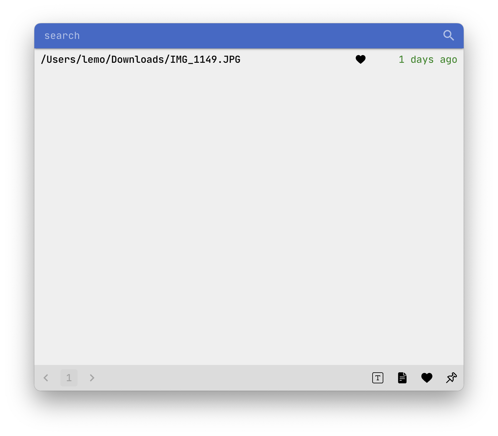

# clipboard

---

---

COMING SOON

-   [ ] Multiple file copy (Color by timeline).
-   [x] File preview (Alt or mousemove)
-   [ ] Right click to open the file or dir.
-   [x] Allow to move window and resize.
-   [x] Support setting page size and total size.
-   [x] Support press up and down to select (Default is the top one).
-   [x] AltOrCommand+B to show.
-   [x] Multiple desktops to show.

MAYBE:

-   [ ] Remark.
-   [ ] Export and Import.
