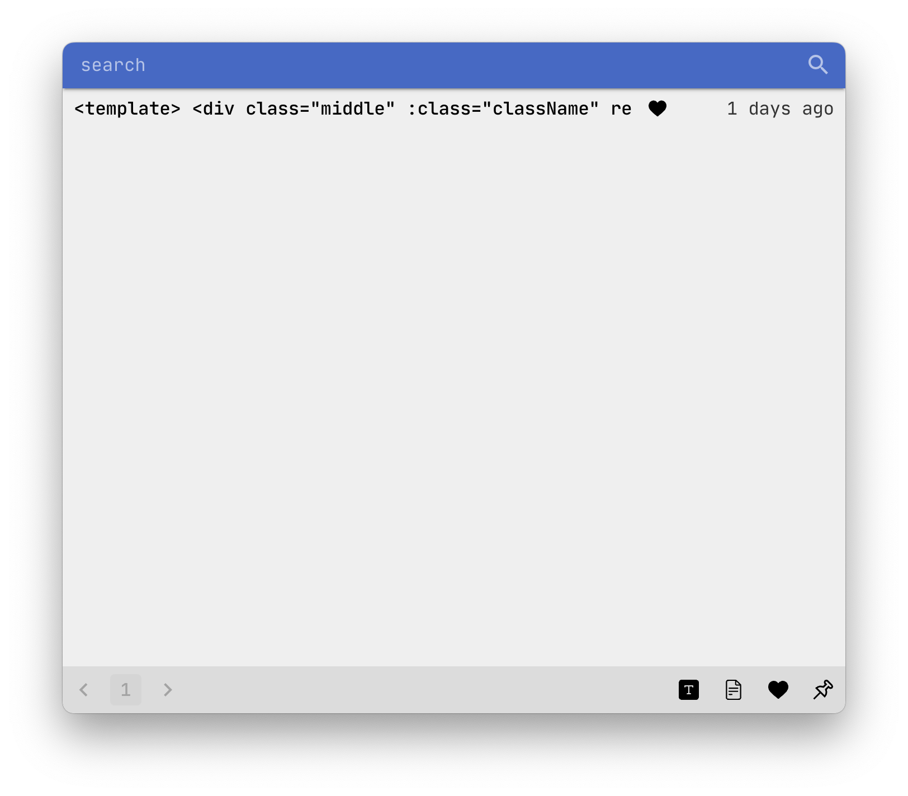
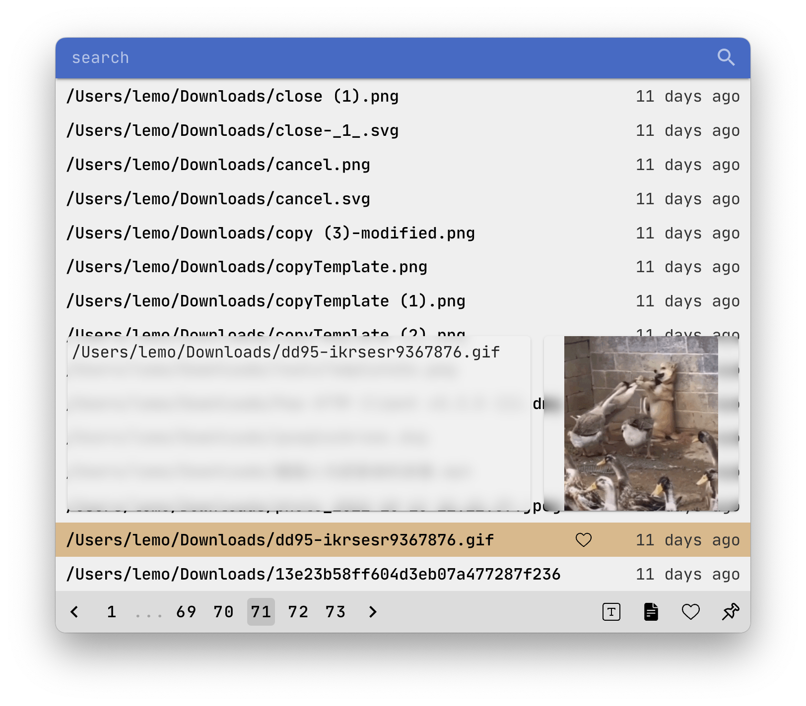

# CLIPBOARD

### HOT KEY

MODE

-   Number 1: Text Mode
-   Number 2: File Mode
-   Number 3: Favorite Mode
-   Number 4: Pin Mode

DIRECTION

-   W & ArrowUp : Move Up
-   S & ArrorDown : Move Down
-   A & ArrowLeft : Prev Page
-   D & ArrowRight : Next Page

OTHER

-   Space : Preview Selected
-   Command Or Alt + B : Show
-   Enter : Copy Selected Or Search
-   Esc : Hide Or Blur Search Input
-   Tab : Focus Search Input

### COMING SOON

-   [x] Use JetBrains Mono fonts.
-   [x] Multiple file copy (Color by timeline).
-   [x] File preview (Alt or mousemove)
-   [x] Right click to open the file or dir.
-   [x] Allow to move window and resize.
-   [x] Support setting page size and total size.
-   [x] Support press up and down to select (Default is the top one).
-   [x] AltOrCommand+B to show.
-   [x] Multiple desktops to show.

### MAYBE:

-   [ ] Remark.
-   [x] Export and Import.
